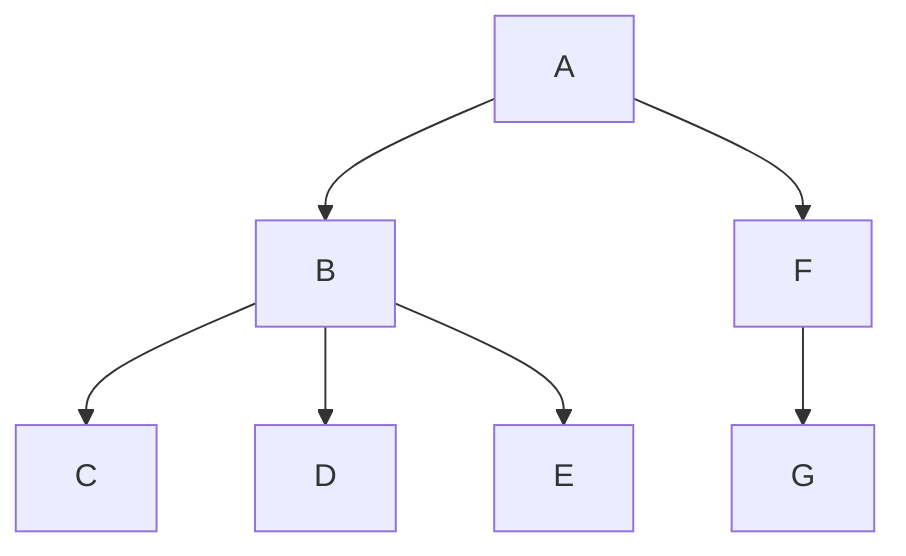

## 写在前面的

本篇文章是对 [unist](https://github.com/syntax-tree/unist) 仓库的官方内容翻译，原文地址: <https://github.com/syntax-tree/unist>。

![unist][logo]

unist, 即: **Uni**versal **S**yntax **T**ree.

**unist** 是一个语法树规范。在 JavaScript 处理语法树上，拥有一个强大的 [工具集生态系统][list-of-utilities]。它的实现基于一些其他的规范。

这篇文档可能不会被发布。参考 [releases][] 页面获取已发布的文档。最新发布版本为 [`3.0.0`][release]。

## 介绍

这篇文章定义了一个通用的语法树格式。unist 的开发开始于 2015 年 7 月。本篇规范使用类 [Web IDL][webidl] 的语法进行书写。

### 语法树

语法树是源代码或自然语言的表示。这些树是抽象的，使得它可以分析、转换和生成代码。

语法树有两种 [形式][abstract-vs-concrete-trees]：

* **具象语法树**：表示每个细节（例如，空格不敏感语言中的空格）的结构。
* **抽象语法树**：只表示代码的语法结构相关的细节（例如，忽略语言是否都支持使用双引号或单引号，如 JavaScript）。

本规范可以同时表示抽象和具象语法树。

### 本规范的适用场景

unist 并不趋向于自给自足。

相反，期望其他规范实现 unist 并扩展它以表示语言特定节点。

举个例子，请参阅如 **[hast][]** (HTML)、**[nlcst][]** (自然语言)、**[mdast][]** (Markdown) 和 **[xast][]** (XML) 等项目。

unist 与 [JSON][] 有关，因为兼容语法树可以完全被 JSON 表示。
然而，unist 并不受限于 JSON，可以表示其他数据格式，如 [XML][]。

unist 与 [JavaScript][] 有关，因为它拥有丰富的 [工具集生态系统][list-of-utilities]，可通过 JavaScript 处理兼容语法树。
五个被使用最多的工具集加起来每个月会被下载三千万次。
然而，unist 并不受限于 JavaScript，可以用于其他编程语言。

unist 与 [unified][]、[remark][]、[rehype][]、[retext][]、[vfile][] 有关，因为它们都在其生态系统中使用 unist 语法树。

unist 与 [vfile][] 有关，因为它接收 unist 节点作为消息存储，并且 vfile 可以作为语法树的源 *[文件][term-file]*。

## 类型

如果你正在使用 TypeScript，你可以通过 npm 安装 unist 类型：

```sh
npm install @types/unist
```

## 节点(Nodes)

unist 语法树中的句法单元叫做节点(nodes)，它实现了 **[Node][dfn-node]** 接口。

### `Node`

```idl
interface Node {
  type: string
  data: Data?
  position: Position?
}
```

`type` 字段是一个非空字符串，表示节点的变体。
这个字段可以被用作确定 *[类型定义][term-type]* 一个节点实现。

`data` 字段表示来源于生态的信息。
`data` 字段的值实现 **[Data][dfn-data]** 接口。

`position` 字段表示节点在源码文件中的位置。
`position` 字段的值实现 **[Position][dfn-position]** 接口。
如果一个节点是被 *[生成][term-generated]* 的，则 `position` 字段一定不存在。

规范实现 unist 时，被鼓励去定义更多的字段。
生态可以在 **[Data][dfn-data]** 接口上定义字段。

unist 的任何值 **必须** 被表示为 JSON 值：`string`，`number`，`object`，`array`，`true`，`false`，或 `null`。
这意味着语法树应该能够被转换为和生成 JSON，并产生相同的树。
例如，在 JavaScript 中，一个树可以通过 `JSON.parse(JSON.stringify(tree))` 转换为 JSON 并产生相同的树。

#### `Position`

```idl
interface Position {
  start: Point
  end: Point
}
```

**Position** 表示一个节点在源码 *[文件][term-file]* 中的位置。

**Position** 中的 `start` 字段表示解析后的源码区域的第一个字符的位置。
`start` 字段的值实现 **[Point][dfn-point]** 接口。

在源码 *[文件][term-file]* 被解析的时候，如果由节点表示的句法单元不存在，则节点被称为 *[被生成][term-generated]*，并且它必须不应该有位置信息。

举个例子，如果下面的值被表示为 unist:

```markdown
alpha
bravo
```

第一个单词 (`alpha`) 开始于第 `1` 行，第 `1` 列，第 `0` 个偏移，并结束于第 `1` 行，第 `6` 列，第 `5` 个偏移。
换行则开始于第 `1` 行，第 `6` 列，第 `5` 个偏移，结束于第 `2` 行，第 `1` 列，第 `6` 个偏移。
最后一个单词 (`bravo`) 开始于第 `2` 行，第 `1` 列，第 `6` 个偏移，并结束于第 `2` 行，第 `6` 列，第 `11` 个偏移。

#### `Point`

```idl
interface Point {
  line: number >= 1
  column: number >= 1
  offset: number >= 0?
}
```

**Point** 代表 *[源文件][term-file]* 中的一个位置。

`line` 字段（1开始索引）代表源文件中的一行。
`column` 字段（1开始索引）代表源文件中的一列。
`offset` 字段（0开始索引）代表源文件中的一个字符。

术语字符表示在 [Web IDL][webidl] 中的一个 (UTF-16) 编码单元。

#### `Data`

```idl
interface Data { }
```

**Data** 表示与生态系统相关的信息。

此空间永远不会被 unist 或者实现 unist 的规范指定。

### `Parent`

```idl
interface Parent <: Node {
  children: [Node]
}
```

节点包含其他节点（被称为 *[子节点][term-child]*）继承抽象接口 **Parent**（**[Node][dfn-node]**）。

`children` 字段表示一个节点的子节点列表。

### `Literal`

```idl
interface Literal <: Node {
  value: any
}
```

节点包含一个值，继承抽象接口 **Literal** (**[Node][dfn-node]**)。

`value` 字段可以包含任何值。

## 术语

### 树

**树** 是一个包含它的所有 *[后代][term-descendant]* 的节点。

### 子节点

如果 Y 的 `children` 包含 X，则 X 是 Y 的 **子节点**。

### 父节点

如果 Y 是 X 的一个 *[子节点][term-child]*，则 Y 是 X 的 **父节点**。

### 索引

子节点的 **索引** 是它 *[兄弟节点][term-sibling]* 之前的数字，如果没有的话则为 `0`。

### 兄弟节点

如果 X 和 Y 有相同的 *[父节点][term-parent]*，则 X 和 Y 是 **兄弟节点**。

*[子节点][term-child]* 的 **前兄弟节点** 是它的 **兄弟节点** *[索引][term-index]* 减 1 的那个。

*[子节点][term-child]* 的 **后兄弟节点** 是它的 **兄弟节点** *[索引][term-index]* 加 1 的那个。

### 根节点

如果没有 *[父节点][term-parent]* 或它的 *[父节点][term-parent]* 的 **根节点**，则 **根节点** 为它自身。

*[树][term-tree]* 的 **根节点** 是 *[树][term-tree]* 没有 *[父节点][term-parent]* 的那个节点。

### 后代

如果 X 是 Y 的一个 *[子节点][term-child]*，那么节点 X 是 Y 的 **后代**。
或者如果 X 是 Z 的一个 *[子节点][term-child]*，且 Z 是 Y 的一个 **后代**，则 X 是 Y 的 **后代**。

一个 **包含后代** 是一个节点，或者是它的 **后代** 之一。

### 祖先

如果 Y 是 X 的一个 *[后代][term-descendant]*，则节点 X 是节点 Y 的 **祖先**。

一个 **包含祖先** 是一个节点，或者是它的 **祖先** 之一。

### 头节点

节点的 **头节点** 是它的第一个 *[子节点][term-child]*。

### 尾节点

节点的 **尾节点** 是它的最后一个 *[子节点][term-child]*。

### 叶节点

**叶节点** 是没有 *[子节点][term-child]* 的节点。

### 分支节点

**分支节点** 是有至少一个 *[子节点][term-child]* 的节点。

### 被生成节点

**被生成节点** 是没有 *[位置信息][term-positional-info]* 的节点。

### 类型

节点的 **类型** 是它的 `type` 字段的值。

### 位置信息

节点的 **位置信息** 是它的 `position` 字段的值。

### 文件

**文件** 是一个源文档，代表被解析生成语法树的原始文件。
*[位置信息][term-positional-info]* 表示节点在这个文件中的位置。
文件由主机环境提供，并不由 unist 定义。

举个例子，参考如 **[vfile][]** 项目。

### 前序遍历

在 [深度优先][traversal-depth] [树遍历][traversal] 中，**前序遍历** 为每个节点 *N* 实现以下步骤：

1. **N**: 访问 *N* 自身
2. **L**: 访问 *[头节点][term-head]* (然后是 *下一个兄弟节点*，递归向前移动直到 *尾节点*)
3. **R**: 遍历 *[尾节点][term-tail]*

### 后序遍历

在 [深度优先][traversal-depth] [树遍历][traversal] 中，**后序遍历** 为每个节点 *N* 实现以下步骤：

1. **L**: 遍历 *[头节点][term-head]* (然后是 *下一个兄弟节点*，递归向前移动直到 *尾节点*)
2. **R**: 遍历 *[尾节点][term-tail]*
3. **N**: 访问 *N* 自身

### 进入

**进入** 就是在当 **[遍历][traversal]** 树时，在对给定节点 *N* 执行其他步骤之前，进行的步骤。

举个例子，当执行 *前序* 遍历时，**进入** 是在访问 *N* 自身之前进行的第一步。

### 离开

**离开** 就是在当 **[遍历][traversal]** 树时，在对给定节点 *N* 执行其他步骤之后，进行的步骤。

举个例子，当执行 *前序* 遍历时，**离开** 是在访问 *N* 的 *[尾节点][term-tail]* 之后进行的最后一步。

## 遍历树

当处理 *[树][term-tree]* 的查询时，**树的遍历** 是一项常规任务。

树的遍历可以分为两种：*广度优先遍历* 和 *深度优先遍历*。

在下面的例子中，我们将使用下面的树：



### 广度优先遍历

**广度优先遍历** 是在遍历 *[子节点][term-child]* 之前，访问一个节点并扩大搜索范围到他在同一层级的所有 *[兄弟节点][term-sibling]*。

在图中定义的语法树，广度优先遍历首先搜索树的根节点（**A**），然后是它的子节点（**B** 和 **F**），然后是它们的子节点（**C**、**D**、**E** 和 **G**）。

### 深度优先遍历

取而代之的，更加常用的是 **深度优先遍历**。
搜索是首先是通过遍历 *[子节点][term-child]* 进行深入，然后再遍历它的 *[兄弟节点][term-sibling]*。

在图中定义的语法树，深度优先遍历首先搜索树的根节点（**A**），然后是它的子节点其中之一（**B** 或 **F**），然后是它们的子节点（**C**、**D**、**E** 或 **G**）。

在给定的有 *[子组件][term-child]* 的节点 *N*，一个 **深度优先遍历** 的实现有三步，简化到二叉树（每个节点都有 *[头节点][term-head]* 和 *[尾节点][term-tail]*，但没有其他子节点）：

* **N**: 访问 *N* 本身
* **L**: 遍历 *[头节点][term-head]*
* **R**: 遍历 *[尾节点][term-tail]*

这些步骤可以按任何顺序执行，但对于非二叉树，**L** 和 **R** 同时发生。
如果 **L** 先于 **R** 执行，则遍历被称为 *左到右* 遍历，否则为 *右到左* 遍历。

对于非二叉树，*头节点* 和 *尾节点* 之间的其他子节点也会按相同顺序处理，因此对于 *左到右* 遍历，首先遍历 *头节点* (**L**)，然后遍历它的 *下一个兄弟节点*，依此类推，最后遍历 *尾节点* (**R**)。

因为对于非二叉树来说，**L** 和 **R** 同时发生，所以我们可以产生四种类型的遍历顺序：NLR、NRL、LRN、RLN。

NLR 和 LRN（两种 *左到右* 遍历选项）是最常用的，分别称为 *[前序遍历][term-preorder]* 和 *[后序遍历][term-postorder]*。

对于图中定义的语法树而言，*前序* 和 *后序* 遍历首先寻找树的根节点（**A**），然后是它的头节点（**B**），然后是它从左到右顺序的子节点（**C**、**D**、**E**）。
在所有 **B** 的 *[后代][term-descendant]* 被遍历之后，它的下一个兄弟节点（**F**）被遍历，然后是它的唯一子节点（**G**）。

## 工具集

**工具集** 是作用节点的函数。

他们是处理 unist 规范实现节点的一些项目：

* [hast 工具集](https://github.com/syntax-tree/hast#list-of-utilities)
* [mdast 工具集](https://github.com/syntax-tree/mdast#list-of-utilities)
* [nlcst 工具集](https://github.com/syntax-tree/nlcst#list-of-utilities)
* [xast 工具集](https://github.com/syntax-tree/xast#list-of-utilities)

### 工具集列表

* [`unist-util-ancestor`](https://github.com/gorango/unist-util-ancestor)
    — 获取一个或多个节点的共同祖先
* [`unist-util-assert`](https://github.com/syntax-tree/unist-util-assert)
    — 断言节点
* [`unist-util-filter`](https://github.com/syntax-tree/unist-util-filter)
    — 使用所有的节点创建一个新的树，并传递一个给定的函数
* [`unist-util-find`](https://github.com/blahah/unist-util-find)
    — 通过条件寻找节点
* [`unist-util-find-after`](https://github.com/syntax-tree/unist-util-find-after)
    — 寻找另一个节点之后的节点
* [`unist-util-find-all-after`](https://github.com/syntax-tree/unist-util-find-all-after)
    — 寻找另一个节点或坐标之后的所有节点
* [`unist-util-find-all-before`](https://github.com/syntax-tree/unist-util-find-all-before)
    — 寻找另一个节点或坐标之前的所有节点
* [`unist-util-find-all-between`](https://github.com/mrzmmr/unist-util-find-all-between)
    — 寻找两个节点或坐标之间的所有节点
* [`unist-util-find-before`](https://github.com/syntax-tree/unist-util-find-before)
    — 寻找另一个节点之前的节点
* [`unist-util-flat-filter`](https://github.com/unicorn-utterances/unist-util-flat-filter)
    — `unist-util-filter` 的扁平化映射版本
* [`unist-util-flatmap`](https://gitlab.com/staltz/unist-util-flatmap)
    — 通过向一个节点拓展的方式创建一个新的树
* [`unist-util-generated`](https://github.com/syntax-tree/unist-util-generated)
    — 检查一个节点是否是被生成的
* [`unist-util-index`](https://github.com/syntax-tree/unist-util-index)
    — 通过属性或者计算的键来索引节点
* [`unist-util-inspect`](https://github.com/syntax-tree/unist-util-inspect)
    — 节点监测工具
* [`unist-util-is`](https://github.com/syntax-tree/unist-util-is)
    — 检查一个节点是否通过测试
* [`unist-util-map`](https://github.com/syntax-tree/unist-util-map)
    — 通过映射节点创建一棵树
* [`unist-util-modify-children`](https://github.com/syntax-tree/unist-util-modify-children)
    — 修改父节点中的直接子节点
* [`unist-util-parents`](https://github.com/syntax-tree/unist-util-parents)
    — 节点的 `父节点` 引用
* [`unist-util-position`](https://github.com/syntax-tree/unist-util-position)
    — 获取节点的坐标信息
* [`unist-util-reduce`](https://github.com/GenerousLabs/unist-util-reduce)
    — 递归 reduce 一棵树
* [`unist-util-remove`](https://github.com/syntax-tree/unist-util-remove)
    — 从树中移除节点
* [`unist-util-remove-position`](https://github.com/syntax-tree/unist-util-remove-position)
    — 移除树中的坐标信息
* [`unist-util-replace-all-between`](https://github.com/unicorn-utterances/unist-util-replace-all-between)
    — 在两个节点或者坐标之间替换节点
* [`unist-util-select`](https://github.com/syntax-tree/unist-util-select)
    — 通过类 CSS 选择器的方式选择节点
* [`unist-util-size`](https://github.com/syntax-tree/unist-util-size)
    — 计算一颗树的节点数量
* [`unist-util-source`](https://github.com/syntax-tree/unist-util-source)
    — 获取文件中值的原始数据（节点或者坐标）
* [`unist-util-stringify-position`](https://github.com/syntax-tree/unist-util-stringify-position)
    — 字符串化一个节点、位置或点
* [`unist-util-visit`](https://github.com/syntax-tree/unist-util-visit)
    — 递归遍历所有节点
* [`unist-util-visit-parents`](https://github.com/syntax-tree/unist-util-visit-parents)
    — 通过一堆父节点递归访问节点
* [`unist-util-visit-children`](https://github.com/syntax-tree/unist-util-visit-children)
    — 访问父节点的直接子节点
* [`unist-util-visit-all-after`](https://github.com/mrzmmr/unist-util-visit-all-after)
    — 访问另一个节点之后的节点
* [`unist-builder`](https://github.com/syntax-tree/unist-builder)
    — 创建树的辅助工具

## 参考材料

* **JavaScript**:
    [ECMAScript Language Specification][javascript].
    Ecma International.
* **JSON**:
    [The JavaScript Object Notation (JSON) Data Interchange Format][json],
    T. Bray.
    IETF.
* **XML**:
    [Extensible Markup Language][xml],
    T. Bray, J. Paoli, C. Sperberg-McQueen, E. Maler, F. Yergeau.
    W3C.
* **Web IDL**:
    [Web IDL][webidl],
    C. McCormack.
    W3C.

## 致谢

最初发行版的作者是：**[@wooorm](https://github.com/wooorm)**。

特别感谢 **[@eush77](https://github.com/eush77)** 的工作，想法和令人难以置信的有价值的反馈！
感谢 **[@anandthakker](https://github.com/anandthakker)**,
**[@anko](https://github.com/anko)**,
**[@arobase-che](https://github.com/arobase-che)**,
**[@azu](https://github.com/azu)**,
**[@BarryThePenguin](https://github.com/BarryThePenguin)**,
**[@ben-eb](https://github.com/ben-eb)**,
**[@blahah](https://github.com/blahah)**,
**[@blakeembrey](https://github.com/blakeembrey)**,
**[@brainkim](https://github.com/brainkim)**,
**[@ChristianMurphy](https://github.com/ChristianMurphy)**,
**[@davidtheclark](https://github.com/davidtheclark)**,
**[@denysdovhan](https://github.com/denysdovhan)**,
**[@derhuerst](https://github.com/derhuerst)**,
**[@dozoisch](https://github.com/dozoisch)**,
**[@fazouane-marouane](https://github.com/fazouane-marouane)**,
**[@gibson042](https://github.com/gibson042)**,
**[@hrajchert](https://github.com/hrajchert)**,
**[@ikatyang](https://github.com/ikatyang)**,
**[@inklesspen](https://github.com/inklesspen)**,
**[@izumin5210](https://github.com/izumin5210)**,
**[@jasonLaster](https://github.com/jasonLaster)**,
**[@JDvorak](https://github.com/JDvorak)**,
**[@jlevy](https://github.com/jlevy)**,
**[@justjake](https://github.com/justjake)**,
**[@kmck](https://github.com/kmck)**,
**[@kt3k](https://github.com/kt3k)**,
**[@KyleAMathews](https://github.com/KyleAMathews)**,
**[@luca3m](https://github.com/luca3m)**,
**[@mattdesl](https://github.com/mattdesl)**,
**[@muraken720](https://github.com/muraken720)**,
**[@mrzmmr](https://github.com/mrzmmr)**,
**[@nwtn](https://github.com/nwtn)**,
**[@rhysd](https://github.com/rhysd)**,
**[@Rokt33r](https://github.com/Rokt33r)**,
**[@Sarah-Seo](https://github.com/Sarah-Seo)**,
**[@sethvincent](https://github.com/sethvincent)**,
**[@shawnbot](https://github.com/shawnbot)**,
**[@simov](https://github.com/simov)**,
**[@staltz](https://github.com/staltz)**,
**[@TitanSnow](https://github.com/TitanSnow)**,
**[@tmcw](https://github.com/tmcw)**,
和
**[@vhf](https://github.com/vhf)**,
为 unist 和相关项目作出的贡献！

## 许可证

[CC-BY-4.0][license] &copy; [Titus Wormer][author]

<!-- Definitions -->

[logo]: https://raw.githubusercontent.com/syntax-tree/unist/367da2e/logo.svg?sanitize=true

[releases]: https://github.com/syntax-tree/unist/releases

[license]: https://creativecommons.org/licenses/by/4.0/

[author]: https://wooorm.com

[release]: https://github.com/syntax-tree/unist/releases/tag/3.0.0

[abstract-vs-concrete-trees]: https://eli.thegreenplace.net/2009/02/16/abstract-vs-concrete-syntax-trees/

[dfn-node]: #node

[dfn-position]: #position

[dfn-point]: #point

[dfn-data]: #data

[term-tree]: #树

[term-preorder]: #前序遍历

[term-postorder]: #后序遍历

[term-child]: #子节点

[term-parent]: #父节点

[term-index]: #索引

[term-sibling]: #兄弟节点

[term-descendant]: #后代

[term-head]: #头节点

[term-tail]: #尾节点

[term-generated]: #被生成节点

[term-type]: #类型

[term-positional-info]: #位置信息

[term-file]: #文件

[traversal]: #遍历树

[traversal-depth]: #深度优先遍历

[list-of-utilities]: #工具集列表

[webidl]: https://webidl.spec.whatwg.org

[json]: https://datatracker.ietf.org/doc/html/rfc7159

[xml]: https://www.w3.org/TR/xml/

[javascript]: https://262.ecma-international.org/9.0/

[hast]: https://github.com/syntax-tree/hast

[xast]: https://github.com/syntax-tree/xast

[nlcst]: https://github.com/syntax-tree/nlcst

[mdast]: https://github.com/syntax-tree/mdast

[unified]: https://github.com/unifiedjs/unified

[remark]: https://github.com/remarkjs/remark

[rehype]: https://github.com/rehypejs/rehype

[retext]: https://github.com/retextjs/retext

[vfile]: https://github.com/vfile/vfile
